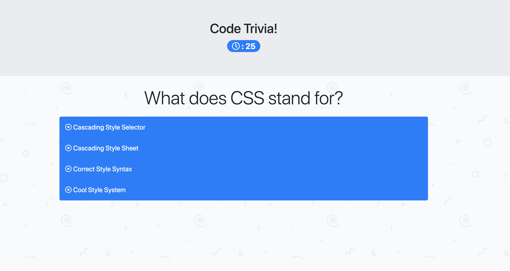

# Code Trivia

Test your knowledge of coding in this thrilling game of trivia!

[Live Site](https://acekreations.github.io/Trivia-Game/)

## Technology Used
---
- HTML
- CSS
- Bootstrap
- JavaScript / Jquery
- Font Awesome

## Learning Points
---
- setTimeout & setInterval
- Object traversal
- A more complete understanding/utilization of Bootstrap - note my nearly empty style.css file

## Author
Craig Melville
